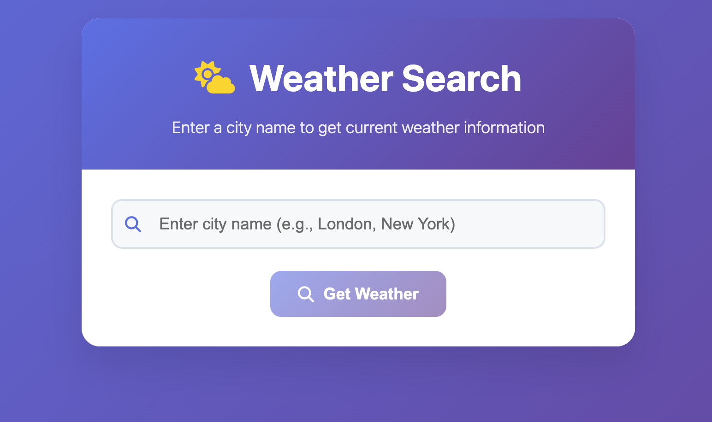

# Weather Search App -  Assessment Overview




**Technology Stack:** PHP + React + OpenWeatherMap API

**Goal:** Build a functional weather search app where users can enter a city name and see current weather data.


## 📁 Project Structure

```
├── index.php              # PHP backend with API endpoints
├── public/
│   ├── index.html         # HTML structure with React CDN
│   ├── app.js             # React components and frontend logic
│   └── style.css          # Professional CSS styling
```

## 🔧 Technical Requirements

### API Integration
- Use OpenWeatherMap Current Weather data API
- **API Documentation:** [OpenWeather API 3.0](https://openweathermap.org/api/)


## 🧪 Testing Your Implementation

1. **Start the PHP server:**
   ```bash
   php -S 0.0.0.0:5000 index.php
   ```

2. **Open your browser:** Navigate to the provided URL

